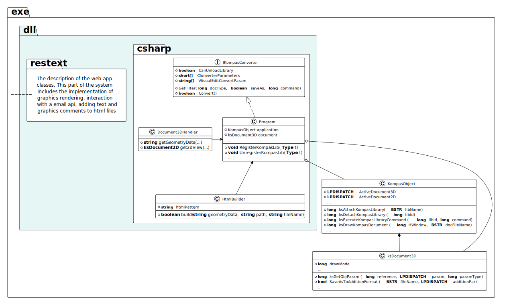
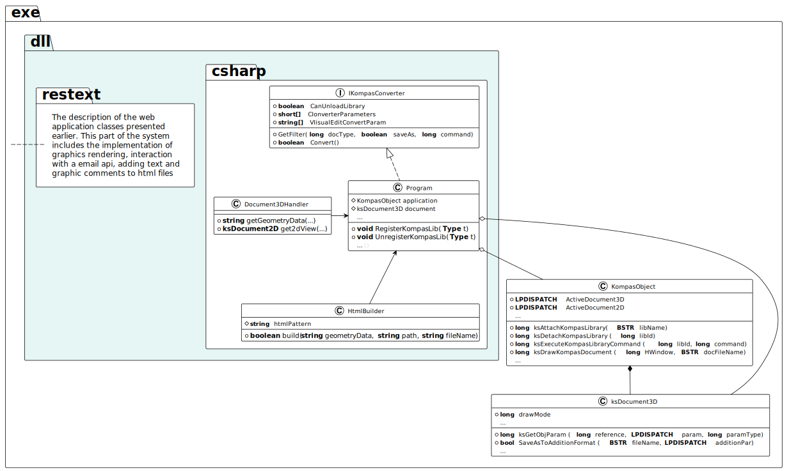

The project aims to improve the process of communication between designers and customers, teachers and students, workers and their colleagues, and all Kompas users. It is a dynamic link library that allows users to save geometry in HTML format, render it, comment on it, share it, and access other useful features. The addon is particularly useful in freelance exchanges, design bureaus, modeling forums, and universities where remote communication is prevalent. Such reports can be sent via messengers and viewed in a browser. Reports don't require special devices or software to view them. Their generation eliminates the need to create screenshots or screencasts and thus saves time.

The aspect of digital transformation is that previously only geometric data was subject to transfer. Now a full-fledged web application is used instead. Unlike other portable formats, HTML has the greatest platform compatibility and integration with libraries, easing communication and visualization on the web. The target system includes components for working with email, adding text and drawn notes, viewing 3D, running the WebGL graphics pipeline.

The architecture of the system can be represented as follows: an instance of the KompasObject class registers the dll using the ksAttachKompasLibrary method. Since the library implements the IKompasConverter interface, it updates the GUI and allows users to generate an HTML reports by calling the saveAs method. It uses an instance of the ksDocument3D class to fetch geometric data and merges it with an HTML page template from resources of the dll.

The system resources are the data that will be used as source code for the generated web applications. This part of the system will contain various elements and include JavaScript code, GLSL shaders and model data.

The positive impact concerns the areas of visualization and communication. These are extremely important elements of project development, which are necessary for the quality of the offer to consumers of objects that companies are interested in developing. It looks like the communication-enhancing addon can be highly valued.

---

In order to simplify the interaction among 3D model developers, the prototype provides the following main features: viewing a model, adding text or graphical comments, sending a report to its developer by e-mail.

